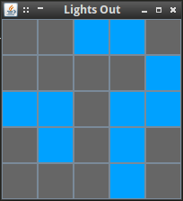

# Lights Out
[Lights Out](https://en.wikipedia.org/wiki/Lights_Out_(game)) is a simple game
where you have a grid of lights and you try to turn them all off. Clicking a
light toggles the light itself and all adjacent lights (not including diagonally
adjacent). This is an implementation using Clojure and
[Seesaw](https://en.wikipedia.org/wiki/Lights_Out_(game)).

## Installation

Just clone this repo and make sure you have [Leinengen](http://leiningen.org/).

## Usage

Run the command `lein run -m lights-out.core`. The game will start and you can
click lights to your heart's content.

## Options

None yet.

## Examples

### Bugs

Currently, all you can do is click the lights. You won't be notified if you win
and there's no option to restart or start a new game.

### Any Other Sections
### That You Think
### Might be Useful

## License

Copyright © 2016 Julius Alexander IV

Distributed under the Eclipse Public License either version 1.0 or (at
your option) any later version.
